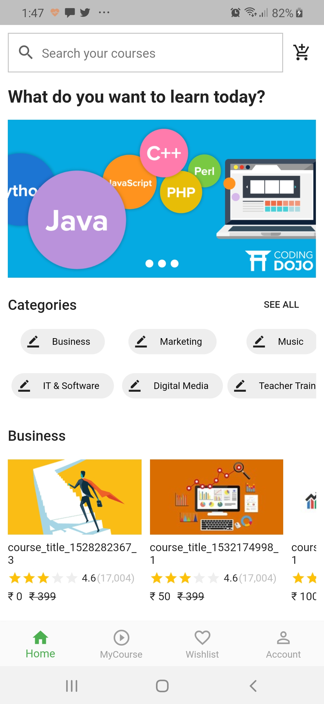
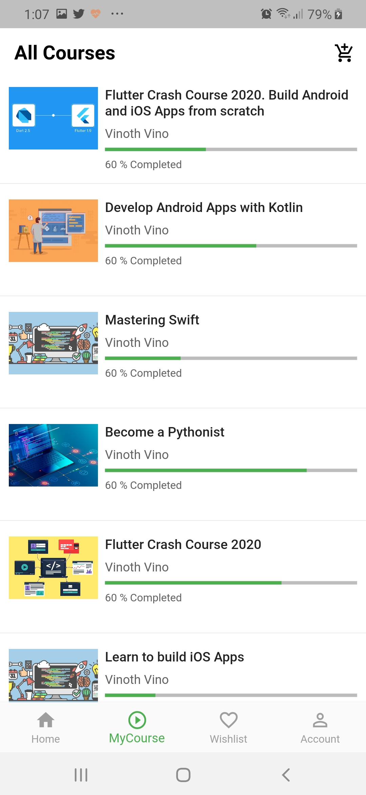
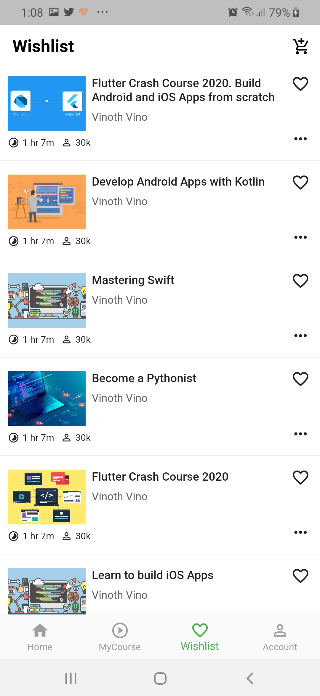
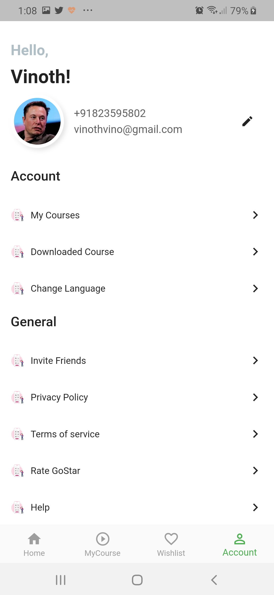
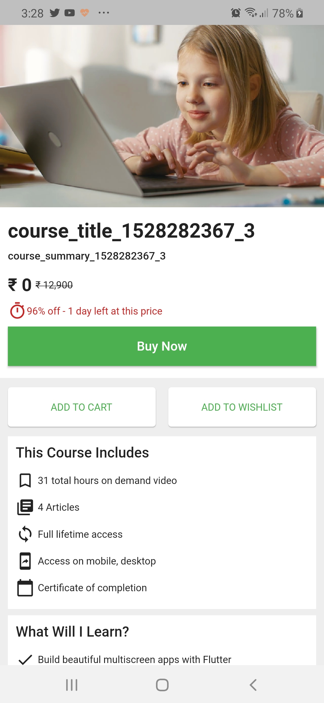
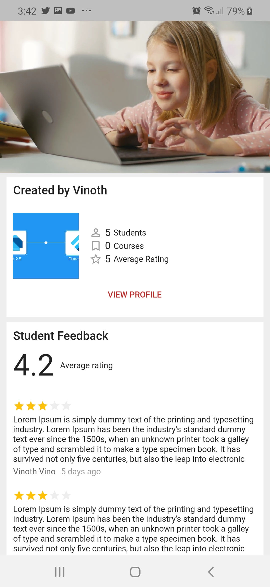
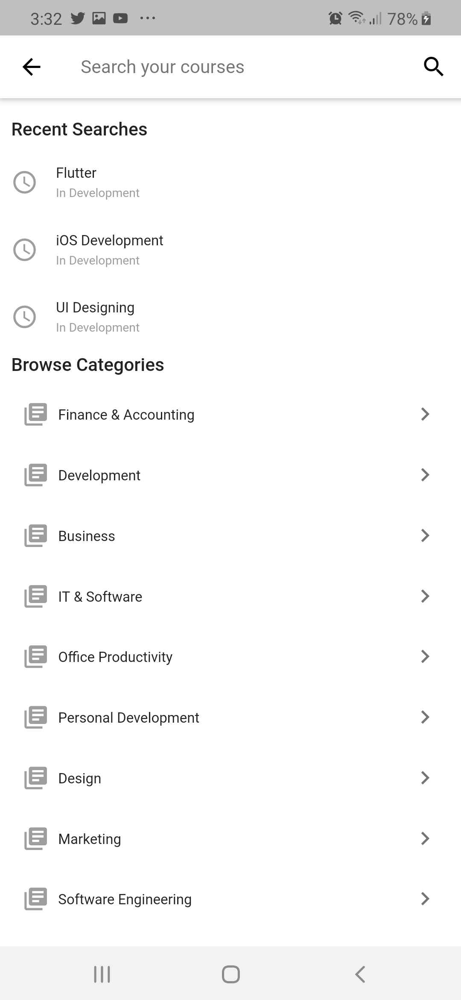
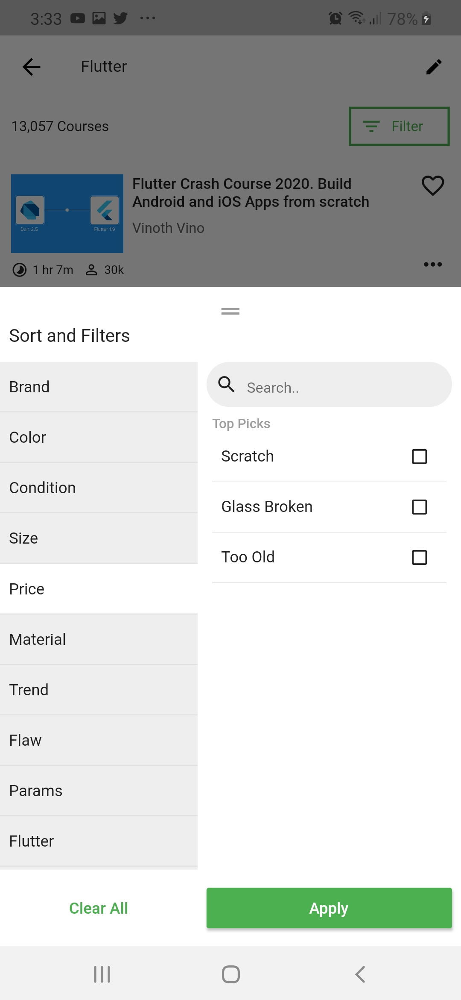

# EduStar

EduStar is an online education platform where students and professionals can learn from it. 

## Screenshots

Home               |  MyCourse                       | Wishlist                            |  Account 
:-------------------------:|:-------------------------:|:-------------------------:|:-------------------------:
||||

Course Detail 1              |  Course Detail 2      |  Search                             | Sort Filter       
:-------------------------:|:-------------------------:|:-------------------------:|:-------------------------:
||||

## Getting started

### Project

1. Open the project and go to ```lib/main``` file.
2. Run the project.

## Directory Structure

```
|-- packages - My custom packages
|-- lib
|   |-- core
|   |   |-- constants
|   |   |-- data_sources
|   |   |-- exceptions
|   |   |-- extensions
|   |   |-- localization
|   |   |-- managers
|   |   |-- models
|   |   |-- repositories
|   |   |-- services
|   |   |-- utils
|   |   |-- view_models
|   |-- ui
|   |   |-- widgets
|   |   |-- shared
|   |   |-- pages
|   |-- main.dart
|   |-- provider_setup.dart
|   |-- router.dart
|-- rest_api
|   |-- edustar_api.http
|-- test
|   |-- integration_test
|   |-- unit_test
|   |-- widget_test


```

### Testing REST API

1. Go to ```rest_api/edustar_api.http``` file.
2. To test the api, click send request button.
3. For changing base url, authorization etc, go to ```.vscode/settings``` file.

```
Note : For testing api, you have to install REST Client extension from visual studio marketplace.
```

## Tests

- In the terminal, type ```flutter test``` to test all the test cases which are inside the ```test``` directory.